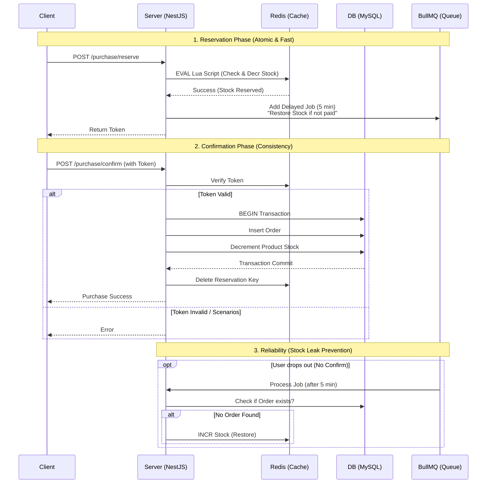

# 🎫 Ticketing: High-Performance Concurrency Control System

> **"10만 명의 동시 접속, 단 100개의 재고. 서버는 무너지지 않고 데이터는 정확해야 합니다."**

**Ticketing**은 대규모 트래픽이 몰리는 선착순 이벤트를 가정한 고성능 백엔드 시스템입니다.  
단순한 CRUD를 넘어, **Redis Lua Script를 활용한 원자적(Atomic) 제어**와 **대기열 시스템**을 통해 Race Condition(경쟁 상태)과 Over-selling(재고 초과 판매) 문제를 원천 차단하는 데 초점을 맞췄습니다. 또한 **BullMQ 기반의 지연 큐(Delayed Queue)**를 도입하여, 결제 이탈 시 재고 누수 없이 정확하게 복구하는 안정성을 확보했습니다.

---

## 🏗 Architecture & Tech Stack

### 🛠 Tech Stack Strategy

이 프로젝트는 **안정성(Stability)**과 **데이터 무결성(Integrity)**을 최우선으로 하여 기술 스택을 선정했습니다.

| Category         | Technology | Version     | Key Decision Factor                                                           |
| :--------------- | :--------- | :---------- | :---------------------------------------------------------------------------- |
| **Framework**    | NestJS     | 10.x        | 모듈형 아키텍처 및 DI를 통한 관심사 분리(SoC) 및 유지보수성 확보              |
| **Language**     | TypeScript | 5.x         | 정적 타입 시스템을 통한 런타임 에러 방지 및 생산성 향상                       |
| **Database**     | MySQL      | **8.4 LTS** | InnoDB의 Locking 메커니즘(Gap Lock, Record Lock) 심층 활용 및 최신 LTS 안정성 |
| **Cache & Lock** | Redis      | **7.4**     | Lua Script를 통한 원자적 연산 수행 및 고성능 트래픽 제어                      |
| **Queue**        | BullMQ     | 5.x         | **Reliable Delayed Job**을 통한 재고 복구(Stock Restoration) 시스템 구현      |
| **Infra**        | Docker     | Compose     | 개발 환경의 완벽한 격리 및 IaC(Infrastructure as Code) 실현                   |

### 📊 System Architecture (Layered View)

1.  **Presentation Layer:** NestJS Controller (Input Validation)
2.  **Application Layer:**
    - **Concurrency Facade:** Redis Lua Script를 통한 원자적 재고 선점.
    - **Stock Watchdog:** BullMQ를 활용하여 미결제 예약 건에 대한 재고 자동 복구 감시.
3.  **Domain Layer:** 비즈니스 로직 및 상태 관리 (Purchase, Order, Admin)
4.  **Infrastructure Layer:**
    - **MySQL:** 최종 주문 데이터의 영속성 보장 (Disk) 및 재고 정합성 유지 (`confirm` 단계)
    - **Redis:** 실시간 재고 차감 및 토큰 기반 예약 관리 (Memory)

### 📐 Sequence Diagram



---

## 🚀 Key Features

### 1. Atomic Inventory Control (Lua Script)

Redis의 `eval` 명령어를 사용해 **재고 조회(GET)와 차감(DECR), 예약 설정(SETEX)을 단 하나의 원자적 작업**으로 처리합니다. 이를 통해 수천 개의 동시 요청이 와도 단 하나의 재고 오류도 허용하지 않습니다.

### 2. Stock Leak Prevention (BullMQ)

사용자가 예약을 선점했으나 결제하지 않고 이탈하는 경우(Stock Leak)를 방지하기 위해, 예약 시점에 **5분 후 실행되는 복구 작업(Delayed Job)**을 큐에 등록합니다. 결제가 완료되면 이 작업은 무시되며, 결제되지 않았다면 자동으로 재고를 원상복구합니다.

### 3. Double Check Consistency

Redis는 트래픽을 방어하는 1차 관문 역할을 하며, 실제 결제 확정(`confirm`) 시에는 **MySQL 트랜잭션**을 통해 주문 생성과 재고 차감을 동시에 수행하여 데이터의 최종 일관성을 보장합니다.

---

## 🚀 Getting Started

이 프로젝트는 `Docker Compose`를 통해 로컬 환경에서 프로덕션과 동일한 인프라를 구성합니다.

### 1. Prerequisites

- Node.js (v18+)
- Docker & Docker Compose

### 2. Installation

```bash
# Install dependencies
npm install
```

### 3. Environment Setup

프로젝트 루트에 `.env` 파일을 생성합니다. (`Joi Validation`을 통해 실행 시 검증)

```Ini, TOML
# Application
NODE_ENV=development
PORT=3000

# Database (MySQL 8.4 LTS)
DB_HOST=localhost
DB_PORT=3306
DB_USERNAME=admin
DB_PASSWORD=root
DB_DATABASE=traffic_buster

# Redis (v7.4)
REDIS_HOST=localhost
REDIS_PORT=6379
```

### 4. Run the Application

DB와 Redis 컨테이너를 실행합니다. (초기 실행 시 MySQL 초기화로 약 10~20초 소요될 수 있습니다.)

```bash
docker-compose up -d
```

### 5. Run Server

```bash
npm run start:dev
```

### 6. Verification (Health Check)

서버와 인프라의 연결 상태를 확인합니다.

- URL: GET http://localhost:3000/health

---

## 📂 Project Structure

관심사의 분리(Separation of Concerns) 원칙에 따라, 도메인 주도 설계(DDD)에 가까운 구조로 모듈을 분리했습니다.

```Plaintext
src/
├── config/                  # 환경 변수 및 BullMQ 설정
├── redis/                   # Redis 모듈 및 Lua Scripts
│   └── lua/                 # purchase.lua (Atomic Operation)
├── domain/                  # 핵심 비즈니스 로메인
│   ├── purchase/            # 상품 구매, 재고 선점, 예약 로직 (BullMQ Processor 포함)
│   └── admin/               # 재고 강제 동기화 등 관리자 기능
├── service/                 # 엔티티 단위의 기본 서비스 (User, Product, Order)
├── common/                  # 공통 필터, 인터셉터, 엔티티
├── app.module.ts            # Root Module
└── main.ts                  # Entry Point
```
